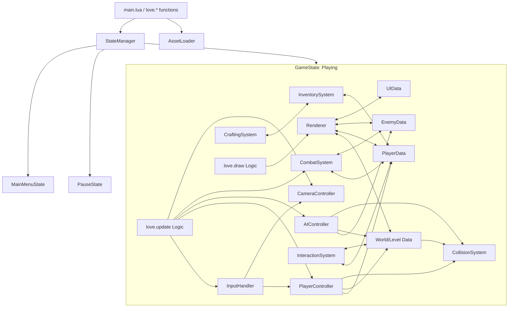

# System Patterns & Architecture

**Status:** [DRAFT] | **Last Updated:** YYYY-MM-DD | **Version:** 1.0 (DOC-YYYYMMDD-1.0)

## Introduction

This document describes the high-level system architecture, key technical design patterns, and component relationships for the game.

## Executive Summary

The architecture will center around Love2D's main loop (`load`, `update`, `draw`). Key systems like rendering, player control, combat, and survival mechanics will be modularized. A state management pattern will handle transitions between game states (e.g., menu, playing, paused).

## Key Points [IMPORTANT]

- **Core Loop:** Utilizes Love2D's `love.load`, `love.update`, `love.draw` cycle.
- **Modularity:** Aim for modular design for major systems (Rendering, Input, Player, AI, Inventory, Crafting, World, UI).
- **State Management:** Implement a finite state machine or similar pattern for managing game states.
- **Rendering Engine:** A dedicated module responsible for the ASCII pseudo-3D rendering.
- **Entity Management:** A system for managing player, enemies, and potentially interactable objects (details TBD).

## High-Level Architecture (Initial Thoughts)

_(Note: This is a preliminary sketch and will be refined)_

## Key Systems (Planned)

1.  **Game State Manager:** Handles transitions between different game phases (Menu, Gameplay, Pause, etc.).
2.  **Rendering Engine:** Manages drawing the ASCII world, characters, effects, and UI.
3.  **Input Handler:** Processes keyboard and mouse input.
4.  **Player Controller:** Manages player state, movement, and actions.
5.  **Camera Controller:** Manages the game view.
6.  **Combat System:** Handles attack logic, damage calculation, health.
7.  **AI System:** Controls enemy behavior.
8.  **Inventory System:** Manages player items.
9.  **Crafting System:** Handles item creation from recipes.
10. **Interaction System:** Manages interactions with world objects.
11. **World/Level Manager:** Loads and manages level data.
12. **UI Manager:** Handles HUD and menus.

## Design Patterns (Potential)

- **State Pattern:** For managing game states.
- **Component Pattern (ECS - Entity Component System):** Potentially for managing entities (player, enemies, items) if complexity warrants.
- **Observer Pattern:** For decoupling systems (e.g., UI observing player health).
- **Singleton Pattern:** Could be used for global managers (Input, Assets), but use judiciously.
- **Module Pattern (Lua Tables):** Standard Lua practice for organizing code into reusable modules.
